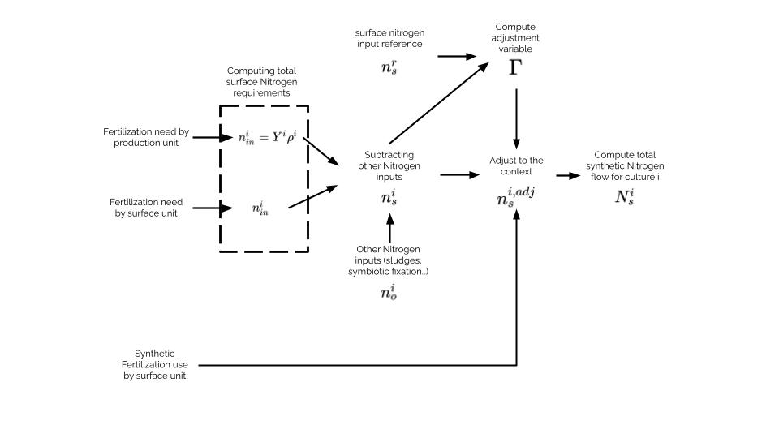

# E-GRAFS Methodology

This document details the **nitrogen mechanisms** of E-GRAFS with explicit **assumptions** and **rationale for the chosen formulations**. We distinguish features that apply to **Historical [H]**, **Prospective [P]**, or **Both [B]**. Carbon is documented elsewhere.
In prospective mode, production in endogenized. In Historic mode, the production is an input data.

## Notation

- Indices: $a$ (Area), $t$ (Year), $c$ (crop), $p$ (product), $l$ (livestock), $e$ (excreta), $h$ (population), $f$ (facility), $G$ (diet group).
- Sets: $\mathcal{C}$ (crops), $\mathcal{P}$ (products), $\mathcal{L}$ (livestock), $\mathcal{E}$ (excreta), $\mathcal{F}$ (facilities), $\mathcal{G}$ (diet groups).
- Units: ktN (nitrogen masses), kgN/ha (areal terms), tFW (fresh mass). Percentages are fractions in $[0,1]$ unless stated otherwise.

## Products flows [H]

Input flows from products are get with product data. For each product $p$ with 'Origin compartment' $j$ (crop or livestock), the inflow is: 
```{math}
F_{jp} = N^{\mathrm{prod}}_{p} * %N_p
```

Availability after pre‑allocation losses (waste and other uses):
```{math}
N^{\mathrm{avail}}_{p} \;=\; N^{\mathrm{prod}}_{p}\,(1 - w^{\mathrm{waste}}_{p} - w^{\mathrm{other}}_{p})\,.
```

The avaiblable Nitrogen amount for each product is then allocated to each consummers by the allocation model (see below).

This flow is now nammed $\text{Nitrogen Production}_i$
## Crops input fertilization flows

Crops can be fertilized by several vector depending of the context : synthetic fertilizer, excretion, atmospheric deposition, seeds...

### Seeds input [B]

Crops might require seeds input. This is Nitrogen input. This is computed as follow for a crop $c$: 
```{math}
F_{\text{seeds}~c} = \text{Seed input}_c * N^{\mathrm{prod}}_{p}
```

### Atmosperic deposition [B]

Atmospheric deposition is modelled in a simple maner with a surface coefficient. The origin of this flow is 90 % from atmospheric NH3 and 10 % from atmospheric N2O as proposed by IPCC {cite:p}`intergovernmentalpanelonclimatechangeClimateChangeLand2022`.
For a crop $c$, the input flow is: 
```{math}
F_{\text{depo}~c} = \text{Atmospheric deposition coef} * a_c
```

### Human excretion [B]

Human excretion is the sum of all Nitrogen Ingested including fischery product. Volatilization and recycling coefficients are used to compute population output flows to atmosphere, lands and water.

#### Sludge spread

The excretion is partially recycled (Excretion recycling input parameter) to be spread on crops. This part is shared among crops according to their area and spreading rate.
Spreading designate the action of manually spreading manure on a field (by opposition to direct excretion on grasslands). A streading rate of 0% means that no hectares benefited from sludges, manure and slurry (whatever is the amount). Spreading rate of 100% means that all hectares of this crop benefited from spreeding. The available amount of sludge Nitrogen is spread using this distribution: 
```{math}
{\rho}_c = \frac{a_c*\text{Spreading rate}_c}{{\sum}_{i\in \mathcal{C}} ~a_i*\text{Spreading rate}_i}
```

With $c$ a crop. Therefore Spreading rate encompass how much a crop will get access to manure, sludge and slurry spreading. 

#### Other fate of human excretion

The rest of human excretion get various fate. These are studied in {cite:p}`starckFateNitrogenFrench2023a`. A part is volatilized as ammoniac ($NH_3$), a part is volatilized as nitrous oxyde ($N_2O$), a part is volilized as nitrous gas ($N_2$). Each of these ends are taken account by parameter 'N-{X} EM excretion' with {X} the name of the volatilized molecule in input data.
All human excretion which is neither volatilized or recycled is lost in hydro-system compartment.

### Animal excretion [B]

E-GRAFS manage 3 kind of excretion managments : manure, slurry and grasslands excretion. Excreta production uses livestock units (LU), excretion factors per LU and indoor/outdoor splits to form the **streams** (e.g., manure, slurry, pasture excretion).

Each stream $e$ is assigned aggregated emission factors; the **effective** ktN that can be spread or sent to energy is:
```{math}
E^{\mathrm{eff}}_{e} \;=\; E_{e}\,\bigl(1 - k^{e}_{\mathrm{NH3}} - k^{e}_{\mathrm{N_2O}} - k^{e}_{\mathrm{N_2}}\bigr)\,.
```

#### Animal indoor excretion

The mecanisms for indoor animal excretion are very similar than human excretion. The same distribution is used for manure and slurry spreading ('Spreading rate (%)' input data).
Two indoor excretion managments are considered in E-GRAFS : slurry and manure. Their have the same mecanisms but with differents technical coefficients. Manure has its own volatilization coefficient, as slurry. 
Another difference with human excretion is that there is no losses in hydro-system compartment. All available manure and slurry is used on crops after volatilization.

#### Animal excretion on grasslands

The proportion of time spend outdoor (1 - Excreted indoor) is the proportion of excretion on grasslands crops. This kind of excretion has its own volatilization coefficients. The distribution of outdoor excretion is simply proportional to grasslands area.

### Biological Nitrogen Fixation [B]

We compute BNF following Anglade et al.{cite:p}`angladeRelationshipsEstimatingN2`:
```{math}
\mathrm{BNF}_c\;=\;\bigl(\alpha_c\cdot \frac{Y_c}{HI_c} + \beta_c\bigr)\cdot BGN_c
```

With ${\alpha}_c$ and ${\beta}_c$ are crop specific slope and intercept of the affine function, Y the yield (kgN/ha), HI the Harvest Index and BGN the belowground contribution multiplicative factor. For more details and  values for ${\alpha}_c$ and ${\beta}_c$ and $BGN_c$, check Anglade paper.

These flows are recorded from atmospheric $N_2$ to the corresponding legume crop nodes.

### Digestate and methanizers [B]

All nitrogen sent to methanizers—whatever its origin (products, excreta, waste)—fully exits as digestate and is then spread under the same rules as human indoor excretion. For excreta routed to the methanizer, we account only the post-volatilization nitrogen (i.e. effective ktN).

Digestate fertilization is computed after solving the allocation because its quantity depends on the chosen energy production and the actual inputs to methanizers. We assume that the extra nitrogen brought by non-excreta inputs to digestate is a small residual flow that does not perturb the nitrogen balance at territory level (it is treated as an internal redistribution).

In Prospective mode, digestate spreading is endogenized in the allocation so that the total fertilisation per crop $F_c$ used by the yield function includes digestate (see production function below).

Methanizer cannot import Nitrogen from outside the territory, Bioreffinery can. Methanizer input can be from products, excretion and waste compartments. Bioreffinery can only use products and waste compartments.

### Synthetic Fertilization in Historic mode [H]

#### Concept

Synthetic fertilization flows are the flows from Haber-Bosch compartment to each crop using synthetic fertilization. Crop category 'leguminous' are excluded from this mecanism.
Synthetic fertilization computation has two alternative mecanisms : 
- Nitrogen balance
- Standard Use

#### Computation by Nitrogen Crop Balance
Synthetic fertilization can be computed based with the gap between fertilization needs and non-synthetic fertilizer used. This gap is normalized using the total amount of synthetic fertilizer used on the territory.  Non-synthetic fertilizer regroup all fertilizing vectors presented above. 

The philosophy behind the flows of synthetic fertilizer use is to proceed to an allocation from the stock of global use of synthetic fertilizer on the territory for a given year to each crops. The distribution of synthetic fertilizer is proportional to the gap between fertilization needs and non-synthetic fertilizer use. 
```{math}
F_{\text{synth tot}} = \sum_{i \in \text{crops}}f_{HB,i} \quad
F_{HB,i} \propto \text{fertilization need}_i - \sum_{j \in \text{non synth fertilization}} F_{ji}
```

##### Mecanism

Total fertilization needs (synthetic + non synthetic) are computed by surface unit. They can be given directly as a constant. This is 'Surface Fertilizer Need (kgN/ha)' in input data. Fertilization needs can also be given by production unit. This is 'Fertilization Need (kgN/qtl)'. The fertilization need is obtain by multiplying by the Yield (qtl/ha). The gap between fertilizer need and surface non synthetic fertilizer use gives the raw synthetic fertilizer use. 
```{math}
N^{i}_{\text{synth input}}=Y^i\rho^{i}_{\text{input}}-N_{\text{other input}} \quad
N^{i}_{\text{synth input}}=N^{i}_{\text{input}}-N_{\text{other inputs}}
```

#### Computation with Standard Use

Synthetic Fertilization can be based on synthetic fertilizer use data as 'Raw Surface Synthetic Fertilizer Use (kgN/ha)' input data of crops tab. The final use of synthetic fertilizer is then normalized to fit 'Total Synthetic Fertilizer Use on crops (ktN)' and 'Total Synthetic Fertilizer Use on grasslands (ktN)' in global input tab (see nest section).

#### Normalization

With $N^{i}_{\text{synth input}}$ denotes the raw compuation of synthetic fertilizer input per hectare for crop $i$, $Y^i$ signifies the yield of crop i, $\rho^{i}_{\text{input}}$ represents fertilization d need per unit of yield (kgN/qtl) and $N_{\text{other inputs}}$ refers to the surface nitrogen input from other sources.
This is a theorical value get with a agronomist computation. Yet the raw synthetic fertilizer must fit the total synthetic fertilization use given in input data. Therefore, the raw values are normalized using this compuation:
```{math}
\Gamma \sum_i N^{i}_{\text{synt input}}\frac{S_i}{S}=N^{\text{input data}}_{\text{synth input}}
```
Where $\Gamma$ is the normalization constant to go from raw values to adjusted values. Then we have:
```{math}
f^{\text{adj}}_{HB,i} = f^{\text{raw}}_{HB,i}\Gamma
```
The flows get after the normalization are called 'Adjusted Total Synthetic Fertilizer Use (ktN)'. The computation steps for synthetic fertilizer use are summed up in this figure



#### Volatilization Losses

In addition to flows from Haber-Bosch process to crops, E-GRAFS compute Nitrogen leaks from crops to atmospheric ammoniac and nitrous oxyde. These flows are computed using 'coefficient N-NH3 volatilization synthetic fertilization (%)' and 'coefficient N-N2O volatilization synthetic fertilization (%)' input data.

#### $N_2$ and the Haber–Bosch compartment

All **synthetic fertiliser** supplied to crops originates from the **Haber–Bosch** compartment. Every fertiliser flow to a crop has its source in this compartment.

To conserve nitrogen, the Haber–Bosch compartment is itself **mass‑balanced** by an inflow from **atmospheric $N_2$**. In other words, the total outflow of nitrogen from Haber–Bosch equals the nitrogen extracted from atmospheric $N_2$ for ammonia synthesis including volatilization losses.

### Production in Prospective mode [P]

#### Crops Production

In prospective mode, the crops productions and therefore the crop Nitrogen balance is endogenized. The mean surface synthetic fertilizer use on crops and grasslands are still needed to give a synthetic fertilizer budget used in objective function (see allocation model section below). The yiels (kgN/ha) if function $Y_c(F)$ of the **total** Nitrogen fertilization inputs. 

the yield response is:
```{math}
Y_c(F) \;=\; Y^{\max}_{c}\,\bigl(1 - e^{-F/F^\star_{c}}\bigr)\,.
```
It is enforced by a piecewise‑linear envelope (SOS2 or convex combination) with breakpoints $(F_{i c}, Y_{i c})$:
```{math}
\sum_i \lambda_{i c}=1,\qquad 
f_c=\sum_i \lambda_{i c} F_{i c},\qquad 
y_c=\sum_i \lambda_{i c} Y_{i c},\qquad 
\lambda_{i c}\ge 0 \text{ and contiguous.}
```
Products of type 'plant' have a production given by 
```{math}
P^i_c = Y_c(F) * Q^i
```

With $Q^i$ the 'Co-production factor' given in product input data.

Legumes have $N^{\mathrm{syn}}_{c}=0$ by construction. The BNF expression is **identical** to Historical, but now $y_c$ is endogenous.

Volatilization and links to Haber Bosch compartment is the same as Historic mode.

#### Animal 

Product of type 'animal' are simply computed using co-production factor and LU :

```{math}
P^i_a = LU * Q^i
```

## Feed–Food–Methanizer Allocation Model (GRAFS‑E)

This section presents the **territory‑level** allocation model that connects **product availabilities** to **consumers** (livestock, population) and **energy facilities** under hard physical constraints and soft preference constraints.

### Philosophy

Linking **food/feed demand** to a **physically coherent** system of flows (local production, imports, exports, human/animal use, methanizer) requires more than a simple mass balance. Detailed information on *who uses which product*, and *gross imports/exports by product*, is often **incomplete** or **heterogeneous**.  
GRAFS‑E closes this gap with a **linear optimization model** (PuLP){cite:p}mitchellPuLPLinearProgramming that allocates nitrogen (N) from products to consumers **under hard constraints** (balances, availabilities, prohibitions) while **minimizing** **diet deviations**, **distribution imbalances**, **gross imports**, and **energy target deviation** for the methanizer.

**In prospective mode**, the production is endogenized with a production function for crops and co-production factor for products. "Size" of compartments (LU, Inhabitant, Area...) are part of scenario by the user.

---

### Notation (mapping to code)

| Concept | Meaning | In code |
|---|---|---|
| Products $p$ | Rows of `df_prod` (e.g., Wheat grain, Soya beans grain) | `df_prod.index` |
| Consumers $c$ | Rows of `df_cons` (Livestock or Population) | `df_cons.index` |
| Diet groups $G$ | Groups defined by the **Diet** table | preprocessed to `(c, G, products_in_G)` |
| Facilities $f$ | Energy infrastructures (Methanizer, Bioraffinery, …) | `df_energy.index` |
| Local allocation | ktN of $p$ to $c$ | `x[(p,c)] ≥ 0` |
| Imports | ktN of $p$ to $c$ | `M[(p,c)] ≥ 0` |
| Export/unused | ktN of $p$ not consumed internally | `U[p] ≥ 0` |
| Facility inputs | ktN of input $i$ to $f$ | `xE[(i,f)] ≥ 0` |
| Diet slack | Deviation for $(c,G)$ | `delta[(c,G)] ≥ 0` |
| Intra‑group slack | Within‑group smoothing for $(c,G,p)$ | `pi[(c,G,p)] ≥ 0` |
| Fair‑share slack | Per product & consumer | `gamma[(p,c)] ≥ 0` |
| Facility diet slacks | Analogous to consumers | `deltaE[(f,G)]`, `piE[(f,G,i)] ≥ 0` |
| Energy dev. | Relative deviation vs target of facility $f$ | `devE[f] ≥ 0` |

---

### Inputs [B]

- **Availability by product** (ktN) after waste/other uses: $N^{\mathrm{avail}}_{p}$.  
- **Consumers**: type $\in\{\text{Human}, \text{Livestock}\}$ and **ingestion requirement** $R_c$ (ktN).  
- **Diets**: target group shares $\pi^\star_{cG}$ and group composition (sets of products).  
- **Facilities**: admissible inputs $i$ (products or excreta) and **powers** $P_{fi}$ (MWh/ktN), plus targets $E^{\mathrm{tar}}_f$ (GWh) if any.  
- **Policy/domain rules**: items forbidden to import (e.g., *grazing*), facility import permissions (e.g., methanizers **no import**, bioraffineries **may import** if enabled).  
- **Weights** (non‑negative): $w^{\mathrm{diet}},w^{\mathrm{intra}},w^{\mathrm{fair}},w^{\mathrm{imp}},w^{E},w^{E\text{-diet}},w^{E\text{-intra}}$.
- **Ingestion requirements** $R_c$ from observed population/LU and per‑capita/LU ingestion.

### Prospective‑specific Inputs [P]

- **Product availabilities** are endogenous via the crop module (yield curves, co‑production).  
- **Synthetic budgets** for crops/grasslands at territory scale.  
- Additional weights: $w^{\mathrm{syn}}, w^{\mathrm{syn\text{-}dist}}$.

---

### Decision variables

#### Common [B]

- $X_{p c}\ge 0$ : ktN of product $p$ allocated to consumer $c$.  
- $M_{p c}\ge 0$ : ktN of product $p$ **imported** for consumer $c$.  
- $U_p\ge 0$ : ktN of product $p$ **exported/unused** internally.  
- $X^{E}_{i f}\ge 0$ : ktN of input $i$ to facility $f$.  
- $\delta_{cG},\ \pi_{cGp},\ \gamma_{p c}\ge 0$ : consumer soft‑constraint slacks.  
- $\delta^{E}_{fG},\ \pi^{E}_{fGi}\ge 0$ : facility soft‑constraint slacks.  
- $\mathrm{dev}^{E}_{f}\ge 0$ : relative deviation from facility energy target.

#### Prospective‑only [P]

- $d^{\mathrm{syn}}\ge 0$ : excess synthetic ktN beyond crop budget.  
- $d^{F^\star}_k\ge 0$ : deviation for non‑legume crop $k$ from $f_k/F^\star_k=1$ (links to crop module).

---

### Hard constraints

> Each constraint is annotated [B] if used in both modes, [P] if Prospective‑only.

#### (H‑1) Product mass balance [B]
```{math}
\sum_{c} X_{p c} \;+\; \sum_{f} X^{E}_{p f} \;+\; U_p \;\le\; N^{\mathrm{avail}}_{p}\,,\qquad \forall p.
```
Internal uses and exports cannot exceed availability within the territory.

#### (H‑2) Consumer ingestion requirement [B]
```{math}
\sum_{G}\sum_{p\in\mathcal{P}_G} \bigl(X_{p c}+M_{p c}\bigr) \;=\; R_c\,,\qquad \forall c.
```
Each consumer must receive exactly its requirement. Human ingestion is given in input data. Animal ingestion is the sum of excretion and production.

#### (H‑3) Import prohibition for grazing [B]
```{math}
M_{p c} \;=\; 0\quad \text{if } p \in \texttt{grazing}.
```
Grazing products are not traded across the territory boundary.

#### (H‑4) Facility domain constraints & energy identity [B]
Admissible inputs only, optional facility‑type import permission, and energy production identity:
```{math}
X^{E}_{i f}=0 \ \text{if } i \notin \mathcal{I}_f,\qquad
M^{E}_{p f}=0 \ \text{if facility } f \text{ forbids imports},
```
```{math}
E_f \;=\; \sum_{i\in\mathcal{I}_f} X^{E}_{i f}\,P_{f i}\,,\qquad \forall f.
```

#### (H‑5) Excreta availability to facilities [B]
```{math}
\sum_{f} X^{E}_{e f} \;\le\; E^{\mathrm{eff}}_{e}\,,\qquad \forall e\in\mathcal{E}.
```
Energy inputs from each excreta stream are limited by effective availability.

#### (H-6) Enforce animal share (optional) [B]
If enabled, the model cannont substitute animal product and plant product. For each $c$:
```{math}
\sum_{p \in \text{diet}(c)\cap \text{Type=animal}} (x_{p,c}+I_{p,c})
= \text{Ingestion}_c \times \text{share_animal}(c).
```

#### (H-7) Optional anti “import & surplus” (MILP) [B]
With product‑specific $M_p$:
```{math}
\sum_{c} I_{p,c} \le M_p\,y_p,\qquad U_p \le M_p\,(1-y_p).
```
> Either **import** or **export surplus** for product $p$, not both.

---

### Soft constraints

#### (S‑1) Diet share respect (consumers) [B]
```{math}
\left|\frac{\sum_{p\in \mathcal{P}_G}(X_{p c}+M_{p c})}{R_c} - \pi^{\star}_{cG}\right| \;\le\; \delta_{cG}\,.
```
This soft constraint limit the gap between the diet of input data and the diet made by the allocation model. Keeps realized diet shares close to targets; slack $\delta_{cG}$ is penalized.

#### (S‑2) Intra‑group smoothing (consumers) [B]
```{math}
\left|X_{p c} - \frac{1}{|\mathcal{P}_G|}\sum_{r\in\mathcal{P}_G} X_{r c}\right| \;\le\; \pi_{c G p}\,.
```
Discourages corner solutions (one item taking all) when several products are nutritionally interchangeable.

#### (S‑3) Fair‑share by product (across consumers) [B]
With references $s^{\mathrm{ref}}_{p c}$ (e.g., historical splits),
```{math}
\left|X_{p c} - s^{\mathrm{ref}}_{p c}\,N^{\mathrm{avail}}_{p}\right| \;\le\; \gamma_{p c}\,.
```
Prevents a product from being monopolized by a single consumer.

#### (S‑4) Facility diet & smoothing [B]
Analogues of (S‑1)–(S‑2) at facility‑level:
```{math}
\left|\frac{\sum_{i\in \mathcal{I}_{f,G}} X^{E}_{i f}}{\sum_{i} X^{E}_{i f}} - \pi^{\star,E}_{fG}\right| \;\le\; \delta^{E}_{fG},\qquad
\left|X^{E}_{i f} - \frac{1}{|\mathcal{I}_{f,G}|}\sum_{r\in \mathcal{I}_{f,G}} X^{E}_{r f}\right| \le \pi^{E}_{f G i}.
```

#### (S‑5) Energy target deviation [B]
Aim to provide as much energy as required in input data:
```{math}
\mathrm{dev}^{E}_{f} \;\ge\; \frac{\left|E_f - E^{\mathrm{tar}}_{f}\right|}{E^{\mathrm{tar}}_{f}}\,.
```
With:
```{math}
E_f = \sum_{i} P_{f,i} \cdot X^{E}_{i f},
```
$P_{f,i}$ is the conversion power of input $i$ in MWh/ktN (from the input data).

#### (S‑6) Synthetic budget (territory) [P]
Aim to do not exceed the synthetic fertiliser usage specified in the input data:
```{math}
d^{\mathrm{syn}} \;\ge\; \sum_{k\in\mathcal{C}_{\mathrm{crops}}} N^{\mathrm{syn}}_{k} - S^{\mathrm{tot}}_{\mathrm{crop}}\,,\qquad d^{\mathrm{syn}}\ge 0.
```

#### (S‑7) Distribution around $F^\star$ (non‑legumes) [P]
Aim to give to each crop a reasonable amount of fertilizer. Avoid under and over fertilization using characteristic fertilization as objective:
```{math}
d^{F^\star}_k \;\ge\; \left|\frac{f_k}{F^\star_{k}} - 1\right|,\qquad k\notin\mathcal{C}_{\mathrm{legume}}.
```

#### (S-8) Yield Target [P]
Aim to keep yields above a crop-specific target. The target yield $Y^{\mathrm{tar}}_k$ is provided in the crop table (column *Target Yield (qtl/ha)*). We introduce a non-negative slack variable $y^{\Delta}_k$ that captures **only relative yield shortfalls**:

```{math}
y^{\Delta}_k \;\ge\; \frac{Y^{\mathrm{tar}}_k - y_k}{Y^{\mathrm{tar}}_k},\qquad
y^{\Delta}_k \;\ge\; 0,\qquad \forall k.
```

Hence, $y^{\Delta}_k = 0$ whenever $y_k \ge Y^{\mathrm{tar}}_k$, and $y^{\Delta}_k$ equals the yield deficit otherwise.

---

### Import penalty (normalized)

To steer the model away from **bulk imports**, we penalize **gross imports** with a **normalized** term:
```{math}
\text{ImportTerm} \;=\; \frac{\sum_{p,c} I_{p,c}}{N^{scale}},
```
where $N^{scale}$ is a **constant** (e.g., a proxy of territory‑level deficit computed from inputs).  
This keeps the model **linear** and makes the weight comparable to other terms.

---

### Objective function

We minimize a weighted sum of deviations and costs:
```{math}
\begin{aligned}
\min\;\; 
&\underbrace{\sum_{c,G} w^{\mathrm{diet}}\;\delta_{cG}}_{\text{respect of diet shares}}
+ \underbrace{\sum_{c,G,p} w^{\mathrm{intra}}\;\pi_{cGp}}_{\text{intra-group smoothing}}
+ \underbrace{\sum_{p,c} w^{\mathrm{fair}}\;\gamma_{p c}}_{\text{fair-share}} \\[4pt]
&+ \underbrace{\sum_{p,c} w^{\mathrm{imp}}\;\frac{M_{p c}}{N^{\mathrm{avail}}_{p}+\varepsilon}}_{\text{imports (normalized)}} 
+ \underbrace{\sum_{f}\!\left( w^{E}\,\mathrm{dev}^{E}_{f} + \sum_{G} w^{E\text{-diet}}\delta^{E}_{fG} + \sum_{G,i} w^{E\text{-intra}}\pi^{E}_{fGi} \right)}_{\text{energy targets and facility diets}} \\[4pt]
&+ \underbrace{w^{\mathrm{syn}}\;d^{\mathrm{syn}}}_{\text{[P] synthetic budget}} 
+ \underbrace{w^{\mathrm{syn\text{-}dist}}\sum_{k\notin \mathcal{C}_{\mathrm{legume}}} d^{F^\star}_k}_{\text{[P] distribution around }F^\star}
+ \underbrace{w^{\mathrm{Y\text{-}target}}\sum_{k} y^{\Delta}k}_{\text{[P] yield shortfall vs. target}}
\end{aligned}
```

Normalizing by counts (products, groups) stabilizes weights across data granularity.

---

### Choosing weights (guidelines)

- **$w^{\mathrm{diet}}$** ↑ : diets stick to targets, fewer substitutions.  
- **$w^{\mathrm{intra}}$** ↑ : smoother within‑group allocations, fewer corner solutions.  
- **$w^{\mathrm{fair}}$** ↑ : products shared more equitably across consumers.  
- **$w^{\mathrm{imp}}$** ↑ : stronger preference for internal resources; imports reduced when possible.  
- **$w^{E}$, $w^{E\text{-diet}}$, $w^{E\text{-intra}}$** ↑ : facilities meet energy targets and diet composition more tightly.  
- **[P] $w^{\mathrm{syn}}$** ↑ : synthetic use kept within budget; exceeding becomes costly.  
- **[P] $w^{\mathrm{syn\text{-}dist}}$** ↑ : fertilisation per non‑legume kept near $F^\star$ (prevents unrealistic extremes).
- **[P] $w^{\mathrm{Y\text{-}target}}$** ↑ : synthetic fertilizer is used to reach yield target given in crop tab. Might be at the expense of total synthetic fertilizer use or other synthetic fertilizer distribution rule.

**Rule of thumb.** Keep *stabilizers* ($w^{\mathrm{intra}}, w^{\mathrm{fair}}$ and energy analogues) about **an order of magnitude below** primary priorities (diet, imports, energy).

Start with something like `(1.0, 1.0, 0.1, 0.1, 1.0, 1.0)` and run small sensitivity sweeps ×{0.5, 1, 2, 5}.  
Inspect the **debug report** (shares %) to see which term dominates and adjust.

---

### Debug & diagnostics (post‑solve)

If debug = True when NitrogenFlowModel is called, the code reconstructs each objective component and prints:
- **weighted contributions** per term,
- **shares %**,
- **solver status**.

Use this to:
- spot unexpected dominance of one term,
- verify soft constraints are active (non‑zero slacks),
- tune weights.

---

### Implementation notes

- Sets/pairs built from `diets` ensure only **valid** `(product,consumer)` variables exist.
- Fair‑share targets per product computed from **normalized** diet shares across all consumers.

---

### Minimal example

A minimal runnable historic mode example with synthetic data is available in **`example/`**:
- `example/GRAFS_project_example_N.xlsx` — Project file,
- `example/GRAFS_data_example_N.xlsx` — Data file.

> You can replicate/extend the example to test different weight sets (e.g., high `Weight import` to emulate 19th‑century import frictions).

A minimal runnable historic mode example with synthetic data is available in **`example/`**:
- `example/GRAFS_project_example_C_prospect.xlsx` — Project file,
- `example/GRAFS_data_example_C_prospect.xlsx` — Data file.

## Crop nitrogen balance [B]

The nitrogen balance is computed per crop $c$ and at the territory scale. It aggregates all nitrogen inputs to the field and compares them to the harvested nitrogen.

### Inputs and outputs

First, we group all the inputs to the field (ktN). Each term corresponds to a vector of nitrogen received by the crop:

- $N^{\mathrm{dep}}_{c}$: Atmospheric deposition.
- $N^{\mathrm{BNF}}_{c}$: Biological nitrogen fixation.
- $N^{\mathrm{excr}}_{c}$: Effective excreta (from both animals and humans) applied to the crop $c$ (after volatilization losses).
- $N^{\mathrm{digest}}_{c}$: Effective digestate applied to the crop $c$ (from methanizers plants).
- $N^{\mathrm{seed}}_{c}$: Nitrogen from seeds.
- $N^{\mathrm{syn,field}}_{c}$: Synthetic nitrogen reaching the field after losses (NH₃, N₂O, etc.).

These contributions form the total nitrogen input to the field:

```{math}
N^{\mathrm{in}}_{c} \;=\; N^{\mathrm{dep}}_{c} + N^{\mathrm{BNF}}_{c} + N^{\mathrm{excr}}_{c}
+ N^{\mathrm{digest}}_{c} + N^{\mathrm{seed}}_{c} + N^{\mathrm{syn,field}}_{c}\,.
```

The output is the nitrogen harvested from the crop (the sum of products originating from $c$):

```{math}
N^{\mathrm{out}}_{c} \;=\; N^{\mathrm{harv}}_{c}\,.
```

### Surplus and mining

We express the balance in terms of positive parts to clarify the subsequent steps:
Surplus $S_c$ represents the positive part of inputs minus outputs;
Mining $M_c$ (soil depletion) represents the positive part of outputs minus inputs.

```{math}
S_c \;=\; \max\!\bigl(N^{\mathrm{in}}_{c} - N^{\mathrm{out}}_{c},\,0\bigr)\,,\qquad
M_c \;=\; \max\!\bigl(N^{\mathrm{out}}_{c} - N^{\mathrm{in}}_{c},\,0\bigr)\,.
```

If the inputs exceed the harvest ($S_c > 0$), the excess nitrogen must be distributed between leaching and soil storage; if the harvest exceeds the inputs ($M_c > 0$), the soil stock is depleted to balance the equation (mining).

### Partition of positive surplus

When $S_c > 0$, the excess nitrogen is partitioned between leaching, N₂O emissions, and soil storage (the remainder). The partitioning coefficients depend on the type of land use and are based on Anglade work {cite:p}`angladeNitrogenSoilSurface`.

**Arable (non‑meadows):**
```{math}
L_c \;=\; 0.7\,S_c,\qquad
E^{\mathrm{surp}}_c \;=\; 0.0025\,S_c,\qquad
\mathrm{SoilStore}^{\mathrm{surp}}_c \;=\; S_c - L_c - E^{\mathrm{surp}}_c\,.
```

**Meadows:** We first store up to a threshold 100 (kgN/ha), and then we split the remaining surplus using same fractions as arable lands:
```{math}
s^{\mathrm{kg/ha}}_c = \frac{S_c\cdot 10^6}{A_c},\quad
\mathrm{FirstStore}_c = \min(s^{\mathrm{kg/ha}}_c,\,T)\,\frac{A_c}{10^6},\quad
R_c = S_c - \mathrm{FirstStore}_c,
```
```{math}
L_c \;=\; 0.7\,R_c,\qquad
E^{\mathrm{surp}}_c \;=\; 0.0025\,R_c,\qquad
\mathrm{SoilStore}^{\mathrm{surp}}_c \;=\; \mathrm{FirstStore}_c + R_c - L_c - E^{\mathrm{surp}}_c\,.
```

On meadows, a portion of the surplus is guaranteed to be stored (up to 100 kgN/ha), reflecting the “buffering” effect of meadows. Beyond this threshold, the behavior is similar to arable land, following the partitioning rules.

### Net soil stock change and surface indicators

The net soil stock change aggregates storage from surplus and mining:

```{math}
\Delta S^{\mathrm{soil}}_c \;=\; \mathrm{SoilStore}^{\mathrm{surp}}_c - M_c\,,
```

For surface indicators (kgN/ha), we convert the masses to a per-hectare basis:

```{math}
\mathrm{Inputs}^{\mathrm{kg/ha}}_{c} \;=\; \frac{N^{\mathrm{in}}_{c}\cdot 10^6}{A_c},\qquad
\mathrm{Surplus}^{\mathrm{kg/ha}}_{c} \;=\; \frac{S_c\cdot 10^6}{A_c}\,.
```

All **crop, livestock, population, and product** compartments are balanced by construction. The GRAFS‑E nitrogen‑flow representation of the agro‑food system is **closed and physically coherent**.

## References

```{bibliography}
:filter: docname in docnames
:style: unsrt
:labelprefix: M