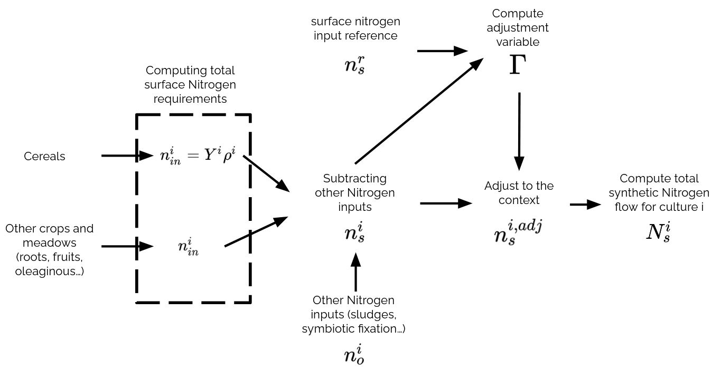

# GRAFS-E Methodology

Here are described GRAFS-E mecanisms to create a coherent flow vision of agro-food systems. Flow building are described by main flow families.

## Input Products flows

Input flows from products are get with product data. For each product $i$ with 'Origin compartment' $j$, the inflow is $$F_{ij} = Production_i * Nitrogen Content_i

This flow is now nammed $Nitrogen Production_i$
## Crops input fertilization flows

Crops can be fertilized by several vector depending of the context : synthetic fertilizer, excretion, atmospheric deposition, seeds...

### Seeds input

Each yearly crops required an initial seeds input to grow. This is computed as follow for a crop $i$ : $$ f_{ii} = Seed input_i * Nitrogen Production_i$$

This is the only self loop in GRAFS-E.

### Atmosperic deposition

Atmospheric deposition is modelled in a simple maner with a surface coefficient. The origin of this flow is 90 % from atmospheric NH3 and 10 % from atmospheric N2O as proposed by IPCC {cite:p}`intergovernmentalpanelonclimatechangeClimateChangeLand2022`.
For a crop $i$, the input flow is : $$f_i = Atmospheric deposition coef_i * Area_i$$ 

### Biological Nitrogen Fixation

Biological Nitrogen Fixation (BNF) is based on Anglade et al. work {cite:p}`angladeRelationshipsEstimatingN2`. This approach propose that BNF is linked to crops production with an affine relation : $$BNF = [{\alpha}_{cult}*\frac{Y}{HI}+{\beta}_{cult}]*BGN$$

With ${\alpha}_{cult}$ and ${\beta}_{cult}$ the slope and XXX of the affine function, Y the yield (kgN/ha), HI the Harvest Index and BGN the Bellowground contribution multiplicative factor. For more details and  values for ${\alpha}_{cult}$ and ${\beta}_{cult}$ and BNG, check Anglade paper.

These computed flows go from atmospheric N2 to concerned crops (the one with non zero BNF coefficients).

### Human excretion

Human excretion is the sum of all Nitrogen Ingested including fischery product.

#### Sludge spread

The excretion is partially recycled (Excretion recycling input parameter) to be spread on crops. This part is shared among crops according to their area and spreading rate.
Spreading designate the action of manually spreading manure on a field (by opposition to direct excretion on grasslands). A streading rate of 0% means that no hectares benefited from sludges, manure and slurry (whatever is the amount). Spreading rate of 100% means that all hectares of this crop benefited from spreeding. The available amount of sludge Nitrogen is spread using this distribution: $${\rho}_i = \frac{Area_i*Spreading rate_i}{{\sum}_{j\in crops, \notin natural meadow} Area_j*Spreading rate_j}$$

With $i$ a crop. Therefore Spreading rate encompass how much a crop will get access to manure, sludge and slurry spreading. 

#### Other fate of human excretion

The rest of human excretion get various fate. These are studied in {cite:p}`starckFateNitrogenFrench2023a`. A part is volatilized as ammoniac ($NH_3$), a part is volatilized as nitrous oxyde ($N_2O$), a part is volilized as nitrous gas ($N_2). Each of these ends are taken account by 'N-X EM excretion' with X the name of the volatilized molecule in input data.
All human excretion which is neither volatilized or recycled is lost in hydro-system compartment.

### Animal excretion

Animal excretion is the sum of ingestion (feed) and animal production (edible, non edible and dairy products). Animal spend time indoor (Excreted indoor parameter) or in grasslands (natural meadows and temporary meadows categories).

#### Animal indoor excretion

The mecanisms for Indoor animal excretion are very similar than human excretion. The same distribution is used for manure and slurry spreading.
Two excretion managments are considered in GRAFS-E : slurry and manure. Their have the same mecanisms but with differents technical coefficients. Manure has its own volatilization coefficient, as slurry. 
Another difference with human excretion is that there is no losses in hydro-system compartment. All available manure and slurry is used on crops after volatilization.

### Animal excretion on grasslands

The proportion of time spend outdoor (1 - Excreted indoor) is the proportion of excretion on grasslands crops. This kind of ecretion has its own volatilization coefficients. The distribution of outdoor excretion is simply proportional to grasslands area.

### Synthetic Fertilization

#### Concept

Synthetic fertilization flows are the flows from Haber-Bosch compartment to each crop using synthetic fertilization. Crop category 'leguminous' are excluded from this mecanism.
Synthetic fertilization is computed based on the gap between fertilization needs and non-synthetic fertilizer used. This gap is normalized using the total amount of synthetic fertilizer used on the territory.  Non-synthetic fertilizer regroup all fertilizing vectors presented above. 

The philosophy behind the flows of synthetic fertilizer use is to proceed to an allocation from the stock of global use of synthetic fertilizer on the territory for a given year to each crops. The distribution of synthetic fertilizer is proportional to the gap between fertilization needs and non-synthetic fertilizer use. 
$$F_{synth~tot} = \sum_{i \in crops}f_{HB,i}$$
$$f_{HB,i} \prop \text{fertilization need}_i - \sum_{j \in \text{non synth fertilization}} f_{ji}$$

#### Mecanism

Synthetic fertilization flows are the flows from Haber-Bosch compartment to each crop using synthetic fertilization. Crop category 'leguminous' are excluded from this mecanism.
Synthetic fertilization is computed based on the gap between fertilization needs and non-synthetic fertilizer used. This gap is normalized using the total amount of synthetic fertilizer used on the territory.  Non-synthetic fertilizer regroup all fertilizing vectors presented above. Fertilization needs are computed by surface unit. They can be given directly as a constant. This is 'Surface Fertilizer Need (kgN/ha)' in input data. Fertilization needs can also be given by production unit. This is 'Fertilization Need (kgN/qtl)'. The fertilization need is obtain by multiplying by the Yield (qtl/ha). The gap between fertilizer need and surface non synthetic fertilizer use gives the raw synthetic fertilizer use. 
$$N^{i}_{\text{synth input}}=Y^i\rho^{i}_{\text{input}}-N_{\text{other input}}$$
$$N^{i}_{\text{synth input}}=N^{i}_{\text{input}}-N_{\text{other input}}$$
With $N^{i}_{\text{synth input}}$ denotes the raw compuation of synthetic fertilizer input per hectare for crop $i$, $Y^i$ signifies the yield of crop i, $\rho^{i}_{\text{input}}$ represents fertilization d need per unit of yield (kgN/qtl) and $N_{\text{other input}}$ refers to the surface nitrogen input from other sources.
This is a theorical value get with a agronomist computation. Yet the raw synthetic fertilizer must fit the total synthetic fertilization use given in input data. Therefore, the raw values are normalized using this compuation : $$\Gamma \sum_i N^{i}_{\text{synt input}}\frac{S_i}{S}=N^{\text{input data}}_{\text{synth input}}$$
Where $\Gamma$ is the normalization constant to go from raw values to adjusted values.
$$f^{\text{adj}}_{HB,i} = f^{\text{raw}}_{HB,i}*\Gamma$$
The flows get after the normalization are called 'Adjusted Total Synthetic Fertilizer Use (ktN)'. The computation steps for synthetic fertilizer use are summed up in this figure



#### Volatilization Losses

In addition to flows from Haber-Basch process to crops, GRAFS-E compute Nitrogen leaks from crops to atmospheric ammoniac and nitrous oxyde. These flows are computed using 'coefficient N-NH3 volatilization synthetic fertilization (%)' and 'coefficient N-N2O volatilization synthetic fertilization (%)' input data.

#### \(N_2\) and the Haber–Bosch compartment

All **synthetic fertiliser** supplied to crops originates from the **Haber–Bosch** compartment. Every fertiliser flow to a crop has its source in this compartment.

To conserve nitrogen, the Haber–Bosch compartment is itself **mass‑balanced** by an inflow from **atmospheric \(N_2\)**. In other words, the total outflow of nitrogen from Haber–Bosch equals the nitrogen extracted from atmospheric \(N_2\) for ammonia synthesis including volatilization losses.

## Feed and Food allocation model

### Philosophy

A touchy point in all physical modelisation of agri-food system is linking food demand to a system-scale coherent flow representation. A simple mass balance equation gives links net import, local production and local consumption (feed and food). However, detailed representation on gross imports and exports, as well as the nitrogen allocations between products, livestock and the local population (i.e., which products are used to feed which group), is usually unavailable or done with too simplistic assumptions.
To clarify the situation, we use an optimisation under constraint model using Pulp {cite:p}`mitchellPuLPLinearProgramming`.
The model aims to optimize the allocation of available nitrogen from crops to various livestock types, considering dietary deviations, penalties for imbalanced resource allocation, and import constraints. The decision variables include the amount of nitrogen allocated from each crop to each livestock type, the deviations from initial dietary proportions, and penalties for concentration of allocations and distribution within crop categories. Additionally, the model accounts for nitrogen imports, with a penalty for exceeding a defined import threshold. We defined the following hard and soft constraints :
- Total feed and food nitrogen requirements of consummers must be satisfied (hard).
- Defined diets in input data can be adapted to import and production availability. Yet deviations must be minimized (soft).
- The gap between net import given in input data and net import as proposed by the allocation model is minimized (soft).
- If a product is not in the input diet of a consummer, no allocation of this product can be done to the consummer (hard).
- The allocations from a products diet group should be distributed among products composing the products group and not rely on only one product (soft).
- Products from crops in the 'natural meadow' category cannot be exported or imported, grazing only (hard).
- Allocation of a product cannot be larger than product production (hard).

Because input data can lack of constancy, it is unlikely that all soft constraints are reached. To address this situation, garanting a physical loop of all flows and providing a realistic representation of agri-food consumption, import/export flow GRAFS-E use an optimization model with previoulsly defined hard constraints. The optimization model is explain in next sections.

### Sets and indices
- \(\mathcal{S}\): diet constraints (each \(s\in\mathcal{S}\) is a consumer group and its product bundle).
- \(\mathcal{I}\): import allocation decision variables.
- \(\mathcal{K}\): local production allocation decision variables.
- \(\mathcal{R}\): diversity penalty variables.

### Parameters
- \(\bar{M}\in\mathbb{R}_{\ge 0}\): target net N imports (ktN) for the territory (exogenous/statistical).
- \(P_{\text{tot}}\in\mathbb{R}_{\ge 0}\): total domestic N production (ktN), computed from input data.
- \(\omega_{\text{dev}},\,\omega_{\text{cult}},\,\omega_{\text{imp}}\in\mathbb{R}_{\ge 0}\): non-negative weights (objective terms: deviations, cropping penalties, trade deviation).

### Decision variables
- \(I_i \ge 0\) for \(i\in\mathcal{I}\): imports (ktN).
- \(X_k \ge 0\) for \(k\in\mathcal{K}\): local productions (ktN).
- \(\delta_s \ge 0\) for \(s\in\mathcal{S}\): diet deviation slacks.
- \(\gamma_r \ge 0\) for \(r\in\mathcal{R}\): diversity penalty slacks.
- \(\Delta_{\text{imp}} \ge 0\): absolute deviation between modeled and target net imports (ktN).

### Modeled net imports

The modeled net import considers that all products (except grasslands products) not consummed locally is exprted :

$$
M \,=\, \sum_{i\in\mathcal{I}} I_i \, -\,\Bigl(P_{\text{tot}} - \sum_{k\in\mathcal{K}} X_k\Bigr)
 \,=\, \sum_{i\in\mathcal{I}} I_i \, +\, \sum_{k\in\mathcal{K}} X_k \, -\, P_{\text{tot}}.
$$

### Soft Constraints

#### Absolute deviation on net imports

$$
\Delta_{\text{imp}} = |M-\bar{M}|.
$$

#### Diet and agronomic feasibility (schematic)

- Diet balance constraints define \(\delta_s \ge 0\) (distance from target diet proportions).
- Diversity constraints define \(\gamma_r \ge 0\).

### Objective function

We minimize a weighted sum of (i) diet deviations, (ii) diversity penalties, and (iii) trade-gap deviation:

$$
\min \;
\underbrace{\omega_{\text{dev}} \sum_{s\in\mathcal{S}} \delta_s}_{\text{diet deviations}}
\;+\;
\underbrace{\omega_{\text{cult}} \sum_{r\in\mathcal{R}} \gamma_r}_{\text{diversity penalties}}
\;+\;
\underbrace{\omega_{\text{imp}} \,\Delta_{\text{imp}}}_{\text{net import deviation}}.
$$

This objective pushes the solution to:
1. Stay close to target diets (small \(\delta_s\)).
2. Allocate nitrogen on all products in diets groups (small \(\gamma_r\)).
3. Match the target net import \(\bar{M}\) (small \(\Delta_{\text{imp}}\)).

### Practical guidance for weights \( \omega \)

#### Short rule of thumb

- Choose \( \omega_{\text{cult}} \approx 0.1 \times \min(\omega_{\text{imp}}, \omega_{\text{dev}}) \).  
  This is usually enough to avoid degenerate allocations (only one product per group) without letting the cultivation penalty dominate.

#### Balancing \( \omega_{\text{dev}} \) vs \( \omega_{\text{imp}} \)

These two weights are typically in tension. Tune them to reflect your trust in each data source:

- If import statistics are reliable and dietary targets are uncertain, prefer \( \omega_{\text{dev}} < \omega_{\text{imp}} \) so the model tolerates deviations from diets to respect net imports.
- If diet targets are solid but import data are coarse, prefer \( \omega_{\text{imp}} < \omega_{\text{dev}} \) so the model keeps diets close and absorbs uncertainty in imports.

Avoid setting one weight orders of magnitude larger than the other unless you *explicitly* want to turn the associated soft constraint into a de‑facto hard constraint. Extreme disparities will force the optimizer to satisfy one objective first and adapt the other to maintain physical coherence.

#### Suggested starting values

\[
\omega_{\text{imp}} = 1,\quad
\omega_{\text{dev}} = 1,\quad
\omega_{\text{cult}} = 0.1.
\]

Then perform a small sensitivity sweep (e.g., multiply \( \omega_{\text{imp}} \) and \( \omega_{\text{dev}} \) by factors in \(\{0.5, 1, 2, 5\}\)) and check:

- Net import gap \( \Delta_{\text{imp}} \) is acceptable.
- Diet deviations remain realistic.
- Allocations are not excessively concentrated within any product group.

#### Sanity checks

- If increasing \( \omega_{\text{dev}} \) barely changes diet deviations, your diet constraints may already be tight elsewhere (e.g., bounds); revisit them.
- If small changes in \( \omega_{\text{imp}} \) cause large swings in allocations, your import target may be too tight or poorly scaled; consider rescaling or widening tolerances.

## Export

Export is deduced with mass balance on each product $i$ : $$N_{export}^i = N_{\text{local production}}^i + N_{import}^i - N_{consumption}^i$$

Each term on the right side of the equation is given by input data or optimization model.

## Final checks

GRAFS‑E performs **mass‑balance checks** for every crop compartment. For all other compartments, balance is enforced by the model’s mechanistic definitions.

- **Deficit (outputs > inputs):**  
  If the total nitrogen outputs of a crop compartment exceed its inputs, the deficit is taken from the **soil stock** compartment. This may indicate (i) an unsustainable agro‑food system, (ii) difficulties in closing loops at the system scale, or (iii) inconsistencies in the input data.

- **Surplus (inputs > outputs):**  
  If the total nitrogen inputs of a crop compartment exceed its outputs, GRAFS‑E distributes the excess depending on the crop category:

  1. **Non‑“natural meadow” crops**: the nitrogen surplus is partitioned as:  
     - **70 %** to **hydrosystem losses**,  
     - **29.25 %** to **other losses**,  
     - **0.75 %** to **atmospheric \(N_2O\)**.

     Formally, for a surplus \(S\) (kg N/ha):  
     \[
     S_{hydro} = 0.70\,S,\quad
     S_{other} = 0.2925\,S,\quad
     S_{N_2O} = 0.0075\,S.
     \]

  2. **“Natural meadow” crops**: the **first 100 kg N/ha** of surplus is directed to the **soil stock**. Any surplus **above 100 kg N/ha** follows the same partitioning as non‑“natural meadow” crops (70 % hydrosystem, 29.25 % other losses, 0.75 % \(N_2O\)).

All **crops, livestock, population, and product** compartments are balanced by construction. Once these checks pass, the GRAFS‑E nitrogen‑flow representation of the agro‑food system is **closed and physically coherent**.

## References

```{bibliography}
:filter: docname in docnames
